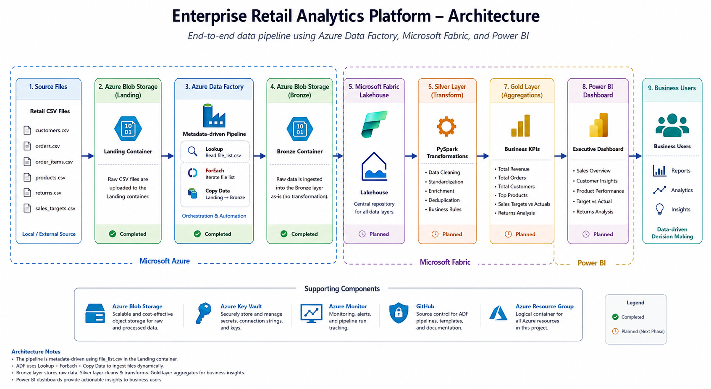
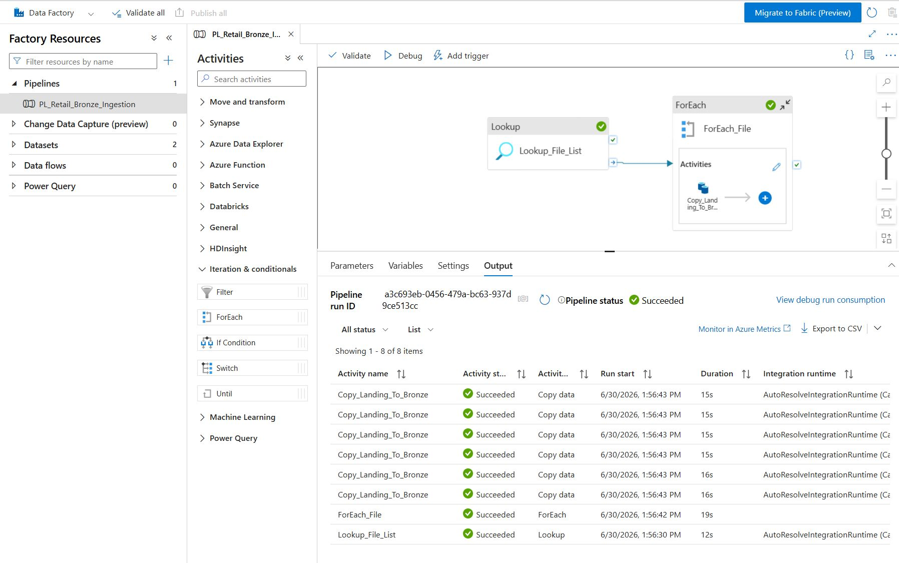
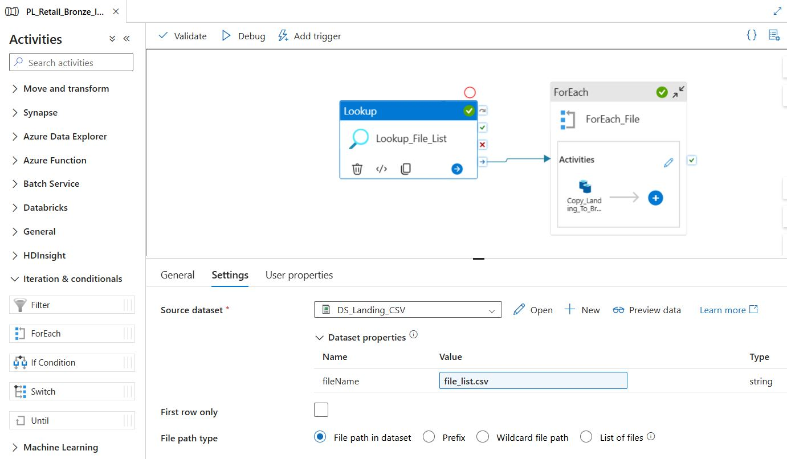
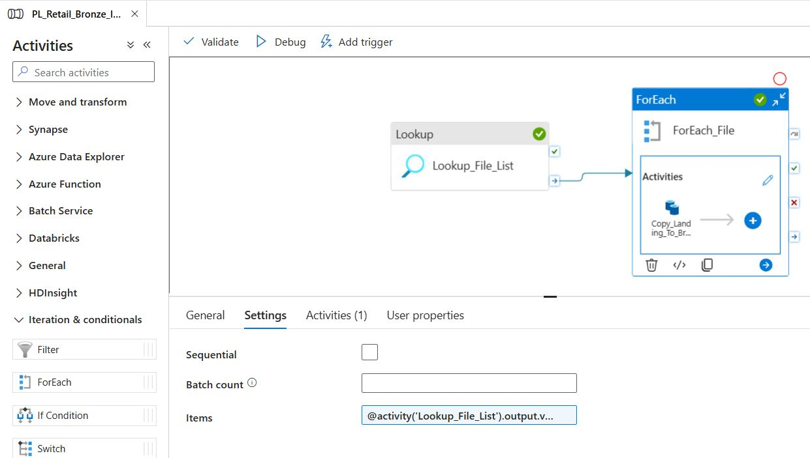
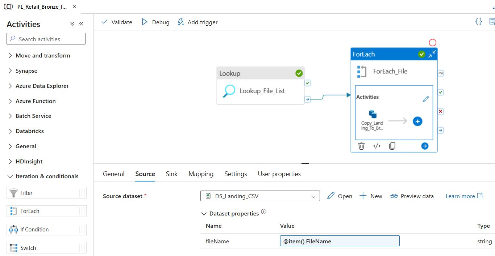
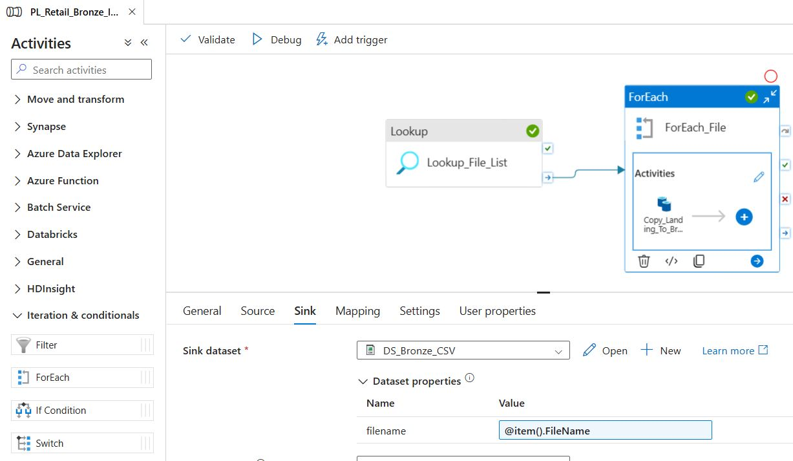
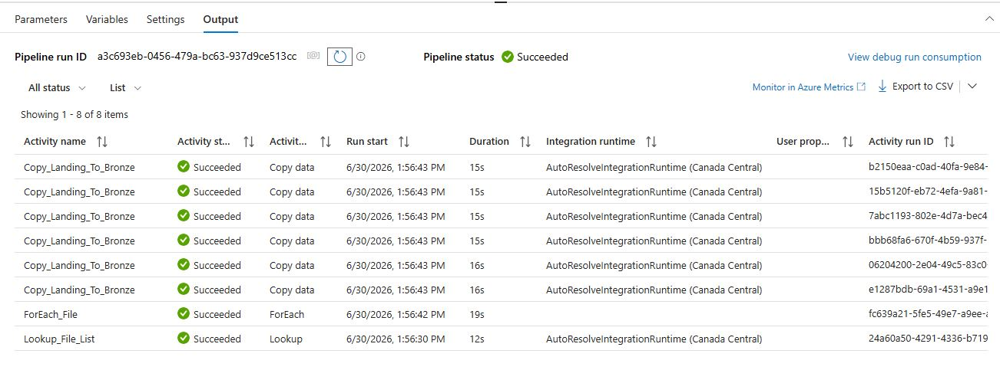
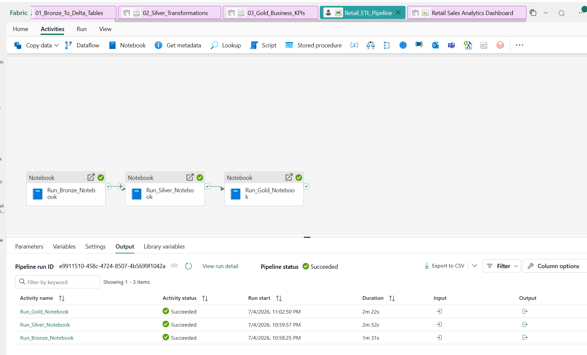
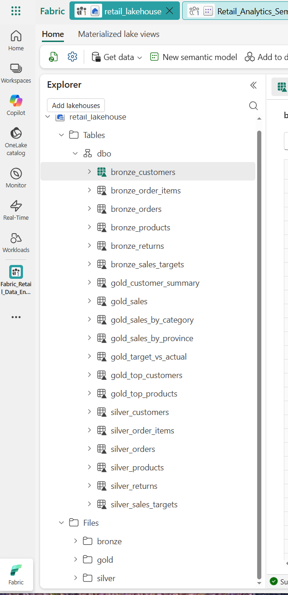
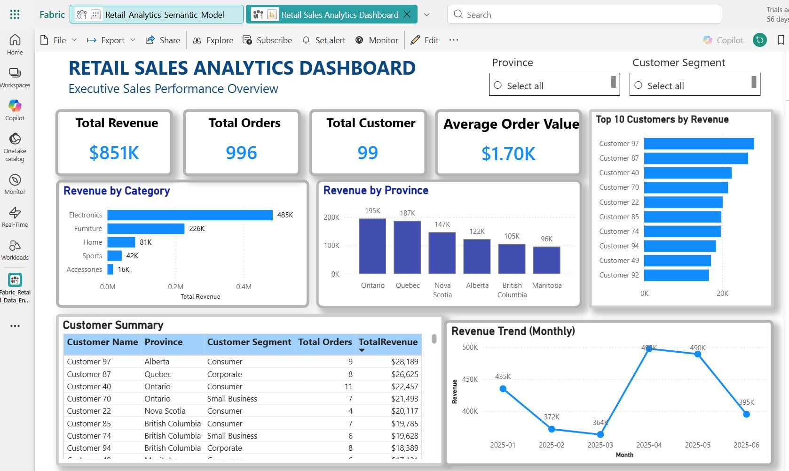

# enterprise-retail-analytics-platform
End-to-end Retail Analytics Platform using Azure Data Factory, Microsoft Fabric, PySpark, Medallion Architecture, and Power BI.

# Enterprise Retail Analytics Platform

End-to-end Retail Analytics Platform built using Azure Data Factory, Azure Blob Storage, Microsoft Fabric, Lakehouse, PySpark, Medallion Architecture, Semantic Model, and Power BI.

## Project Overview

This project demonstrates a production-style retail analytics platform that ingests multiple retail datasets using Azure Data Factory, transforms the data using Microsoft Fabric notebooks, implements the Medallion Architecture (Bronze → Silver → Gold), and delivers executive business insights through an interactive Power BI dashboard.


## Project Status

This project delivers a complete end-to-end retail analytics platform built with Azure Data Factory, Azure Blob Storage, Microsoft Fabric, PySpark, Medallion Architecture, and Power BI.

### Completed Components

- Azure Blob Storage (Landing & Bronze)
- Azure Data Factory metadata-driven ingestion
- Microsoft Fabric Lakehouse
- Bronze Delta Tables
- Silver Transformation Layer
- Gold Business KPI Tables
- Microsoft Fabric ETL Pipeline
- Semantic Model
- Executive Power BI Dashboard


## Solution Architecture

```
Retail CSV Files
        │
        ▼
Azure Blob Storage (Landing)
        │
        ▼
Azure Data Factory
(Lookup + ForEach + Copy Data)
        │
        ▼
Azure Blob Storage (Bronze)
        │
        ▼
Microsoft Fabric Lakehouse
        │
        ▼
Bronze Delta Tables
        │
        ▼
Silver Layer (PySpark Transformations)
        │
        ▼
Gold Layer (Business KPIs)
        │
        ▼
Semantic Model
        │
        ▼
Power BI Executive Dashboard
        │
        ▼
Business Users
```

### Architecture Diagram

<p align="center">
  
</p>

## Technologies Used

### Cloud & Storage
- Microsoft Fabric
- Azure Data Factory (ADF)
- Azure Blob Storage
- Microsoft Fabric Lakehouse

### Data Engineering
- PySpark
- Delta Lake
- Medallion Architecture (Bronze, Silver, Gold)
- Microsoft Fabric Data Pipeline

### Analytics & Reporting
- Semantic Model
- Power BI

### Version Control
- Git
- GitHub

## Dataset

The project uses six retail CSV files:

- customers.csv
- orders.csv
- order_items.csv
- products.csv
- returns.csv
- sales_targets.csv


## Azure Data Factory Pipeline

The ingestion pipeline uses:

- `Lookup_File_List`
- `ForEach_File`
- `Copy_Landing_To_Bronze`
- `DS_Landing_CSV`
- `DS_Bronze_CSV`

## Screenshots

### Pipeline Overview

<p align="center">
  
</p>

### Lookup Activity

<p align="center">
  
</p>

### ForEach Settings

<p align="center">
  
</p>

### Copy Source

<p align="center">
  
</p>

### Copy Sink

<p align="center">
  
</p>

### Pipeline Success

<p align="center">
  
</p>


## Microsoft Fabric

### Fabric ETL Pipeline

The Microsoft Fabric Data Pipeline orchestrates the complete ETL workflow by executing three PySpark notebooks sequentially:

- 01_Bronze_To_Delta_Tables
- 02_Silver_Transformations
- 03_Gold_Business_KPIs

The pipeline successfully loads raw retail data into Bronze Delta tables, transforms and cleans data in the Silver layer, and creates Gold business KPI tables for analytics.

### Fabric Pipeline

<p align="center">
  
</p>

### Lakehouse Tables

The Lakehouse implements a Medallion Architecture containing Bronze, Silver, and Gold Delta tables used for downstream analytics and reporting.

<p align="center">
  
</p>


# Power BI Dashboard

The final reporting layer of the solution is built using Microsoft Power BI connected to the Microsoft Fabric Semantic Model. The dashboard enables interactive analysis of retail sales performance and business KPIs.

### Dashboard Features

- Executive KPI Cards
  - Total Revenue
  - Total Orders
  - Total Customers
  - Average Order Value

- Sales Analysis
  - Revenue by Category
  - Revenue by Province
  - Monthly Revenue Trend

- Customer Analysis
  - Top 10 Customers by Revenue
  - Customer Summary Table

- Interactive Filters
  - Province
  - Customer Segment

### Dashboard Screenshot

<p align="center">
  
</p>


## Resume Highlight

Built an end-to-end Retail Analytics Platform using Azure Data Factory, Microsoft Fabric, PySpark, Delta Lake, Medallion Architecture, and Power BI. Developed metadata-driven ETL pipelines, Bronze/Silver/Gold data layers, a Semantic Model, and an executive analytics dashboard.
